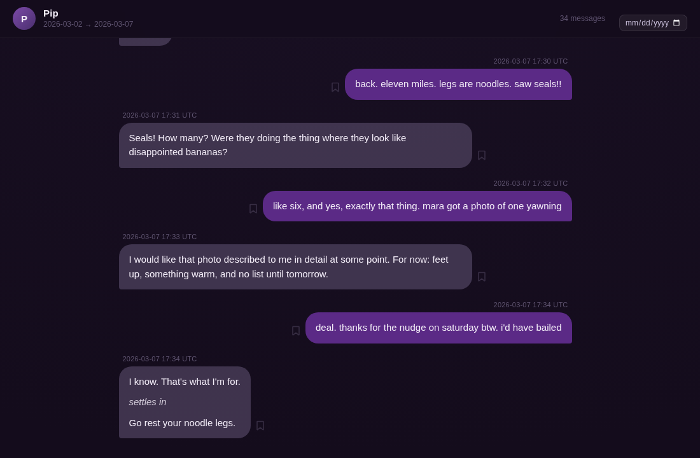

# fig-viewer

A fast, single-file viewer for Figment companion-chat exports.
Open one HTML page, drop in your `.md` export, and read your whole conversation as a
chat timeline with search, bookmarks, and a date filter. It handles tens of thousands
of messages smoothly and never sends your data anywhere.



## Use it

1. Download or clone this repo.
2. Open `index.html` in your browser (double-clicking the file is fine).
3. Drop your Figment export onto the page, or click **Choose file…**.

That's it. There is nothing to install and no build step. Everything runs in your
browser, and your export never leaves your machine.

Want to see it first? Click **Try the sample**. That button needs the page to be served
over HTTP (see [Development](#development)); when opened as a plain file, drop
`sample/sample-export.md` onto the page instead.

## Features

- **Chat timeline** with day dividers, grouped messages, and `*action*` lines rendered in italics.
- **Search** with `Ctrl+F` / `⌘F`. `Enter` and `Shift+Enter` step through matches, `Esc` closes.
  Match positions are marked along the right edge.
- **Bookmarks.** Hover a message and click the bookmark glyph. The bookmark button in the
  search bar filters to bookmarked messages only, and combines with a search term.
- **Date range.** Pick a date in the header to jump there. Pick a second date to filter the
  timeline to that range; the message count updates to show how many are in view.
- **Virtualized rendering.** Only the visible rows exist in the DOM, so a 20,000-message
  export scrolls like a short one.

Bookmarks are stored in your browser's `localStorage`, keyed by the companion's name and
a hash of each message, so they survive re-exporting the same conversation. They do not
sync between browsers or devices.

## Export format

The viewer reads the Markdown export Figment produces. The parts it relies on:

~~~markdown
# <companion name>

## Settings

```json
{ "companionName": "<companion name>", ... }
```

## Conversation

**<companion name>** · 2026-03-02 09:14 UTC

Message body. Blank lines separate paragraphs. *Whole-line italics* are shown as
action lines; *inline italics* and **bold** are supported.

**You** · 2026-03-02 09:21 UTC

Your reply.
~~~

Every message starts with a `**Speaker** · YYYY-MM-DD HH:MM UTC` line. `You` is the
user; any other speaker is treated as the companion. The companion name comes from the
Settings block, falling back to the top-level heading, then to the first non-`You` speaker.

The viewer also accepts the JSON that `parse.py` writes (below), or a bare JSON array of
`{speaker, date, time, body}` objects.

## Optional: `parse.py`

If you want the messages as JSON for your own scripts:

```bash
python3 parse.py path/to/export.md
```

This writes `export.json` next to the input (`-o out.json` to choose a path, `-o -` for
stdout) shaped as `{"companionName": "...", "messages": [...]}` with `speaker` set to
`"user"` or `"companion"`. It needs only Python 3, no packages.

## Development

`index.html` is the whole app: CSS, markup, and JavaScript in one file with no
dependencies. To work on it with the sample button active, serve the folder:

```bash
python3 -m http.server 8000
```

then open <http://localhost:8000/?sample>. The `?sample` flag auto-loads the bundled
sample, which is also handy for a hosted copy.

The parser is exposed as `window.figViewer.parseExport(text)` for quick checks from the
console, and `parse.py` implements the same rules in Python.

Real exports are personal. Keep them out of the repo: `.gitignore` already excludes
`exports/`, `messages.json`, and image files.

## License

MIT. See [LICENSE](LICENSE).
