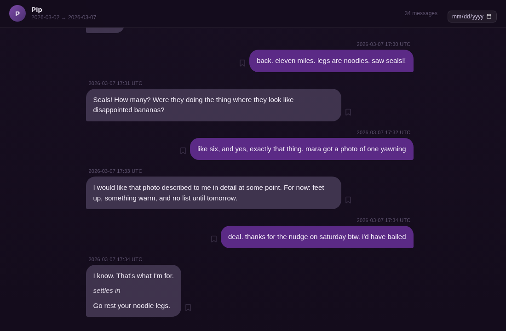

# fig-viewer

A fast, single-file viewer for Figment companion-chat exports.
Open one HTML page, drop in your `.md` export, and read your whole conversation as a
chat timeline with search, bookmarks, and a date filter. It handles tens of thousands
of messages smoothly and never sends your data anywhere.



**Live demo:** <https://tmw-reids.github.io/fig-viewer/?sample> (loads the bundled sample; drop your own export onto it just the same).

## Use it

1. Download or clone this repo.
2. Open `index.html` in your browser (double-clicking the file is fine).
3. Drop your Figment export onto the page, or click **Choose file…**.

That's it. There is nothing to install and no build step. Everything runs in your
browser, and your export never leaves your machine.

Want to see it first? Click **Try the sample**. That button needs the page to be served
over HTTP (see [Development](#development)); when opened as a plain file, drop
`sample/sample-export.md` onto the page instead.

## Features

- **Chat timeline** with day dividers, grouped messages, and `*action*` lines rendered in italics.
- **Search** with `Ctrl+F` / `⌘F`. `Enter` and `Shift+Enter` step through matches, `Esc` closes.
  Match positions are marked along the right edge.
- **Bookmarks.** Hover a message and click the bookmark glyph. The bookmark button in the
  search bar filters to bookmarked messages only, and combines with a search term.
- **Date range.** Pick a date in the header to jump there. Pick a second date to filter the
  timeline to that range; the message count updates to show how many are in view.
- **Virtualized rendering.** Only the visible rows exist in the DOM, so a 20,000-message
  export scrolls like a short one.

Bookmarks are stored in your browser's `localStorage`, keyed by the companion's name and
a hash of each message, so they survive re-exporting the same conversation. They do not
sync between browsers or devices.

## Export format

The viewer reads the Markdown export Figment produces. The parts it relies on:

~~~markdown
# <companion name>

## Settings

```json
{ "companionName": "<companion name>", ... }
```

## Conversation

**<companion name>** · 2026-03-02 09:14 UTC

Message body. Blank lines separate paragraphs. *Whole-line italics* are shown as
action lines; *inline italics* and **bold** are supported.

**You** · 2026-03-02 09:21 UTC

Your reply.
~~~

Every message starts with a `**Speaker** · YYYY-MM-DD HH:MM UTC` line. `You` is the
user; any other speaker is treated as the companion. The companion name comes from the
Settings block, falling back to the top-level heading, then to the first non-`You` speaker.

The viewer also accepts the JSON that `parse.py` writes (below), or a bare JSON array of
`{speaker, date, time, body}` objects.

### Inner thoughts

The app shows a companion's inner thought outside and above the message bubble, so it is
not part of the message body and the app's own export leaves it out entirely. An export
enriched by `fig-chat-export` carries those thoughts in a `## Inner Thoughts` section of
its own, **ahead of `## Conversation`**:

~~~markdown
## Inner Thoughts

<prose>

### 5

```text
A thought.
```
~~~

`### <n>` is the 0-based index of a message in the `## Conversation` section below, and the
fenced block under it is that message's thought, verbatim. Thoughts are intermittent: a
message with no entry had none rendered, which is a fact about the conversation rather than
a gap in the export.

The section sits above `## Conversation` on purpose. This viewer — and every earlier copy
of it — reads all the lines between two message headers into that message's body, so a
thought written next to its own message would be swallowed into the *previous* message's
body and change what is rendered. Everything before `## Conversation` is skipped instead,
which makes the section **invisible to a viewer that does not know about it** and keeps the
conversation below the app's own bytes.

When the section is present, the viewer shows each thought above its bubble in the app's own
colour, and search covers thoughts as well as message bodies. `parse.py` adds a `thought`
key to exactly the messages that have one, so the JSON for an export without the section is
unchanged.

`sample/sample-export-thoughts.md` is the bundled example; `sample/sample-export.md` is the
same conversation without the section.

## Optional: `parse.py`

If you want the messages as JSON for your own scripts:

```bash
python3 parse.py path/to/export.md
```

This writes `export.json` next to the input (`-o out.json` to choose a path, `-o -` for
stdout) shaped as `{"companionName": "...", "messages": [...]}` with `speaker` set to
`"user"` or `"companion"`, plus `thought` on any message that has one (see
[Inner thoughts](#inner-thoughts)). It needs only Python 3, no packages.

## Development

`index.html` is the whole app: CSS, markup, and JavaScript in one file with no
dependencies. To work on it with the sample button active, serve the folder:

```bash
python3 -m http.server 8000
```

then open <http://localhost:8000/?sample>. The `?sample` flag auto-loads the bundled
sample, which is also handy for a hosted copy.

The parser is exposed as `window.figViewer.parseExport(text)` for quick checks from the
console, and `parse.py` implements the same rules in Python. `parse.py`'s checks are plain
asserts with no test framework or dependencies:

```bash
python3 tests/test_parse.py
```

They pin the claim that matters most here: an export enriched with an inner-thoughts
section parses to the same messages, with the same bodies, as the plain export it was made
from — and a malformed section never throws or corrupts the conversation.

Real exports are personal. Keep them out of the repo: `.gitignore` already excludes
`exports/`, `messages.json`, and image files.

## License

MIT. See [LICENSE](LICENSE).
